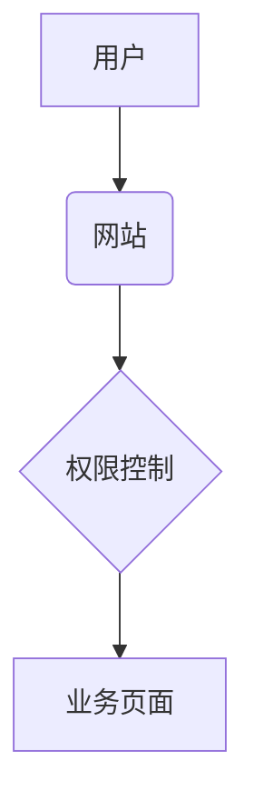
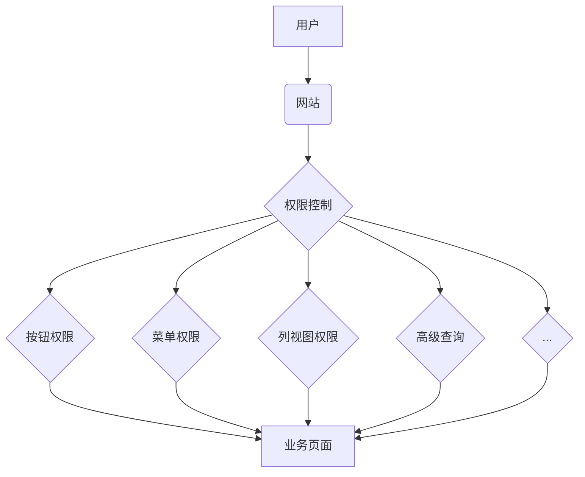
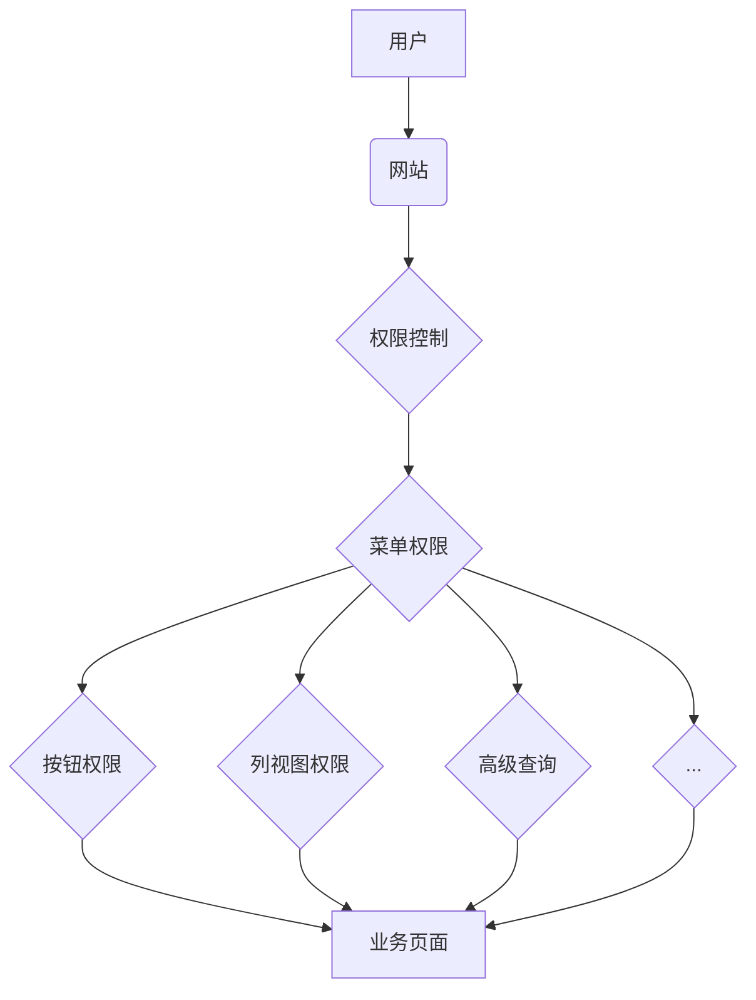
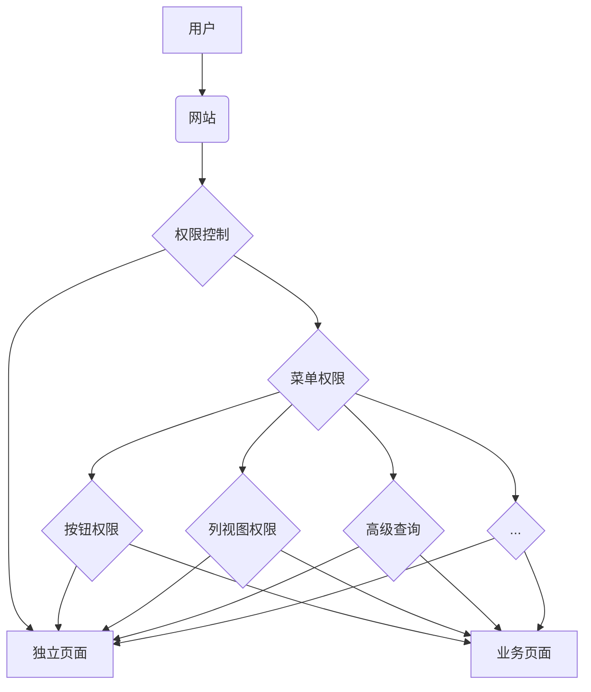

一般我们写后台系统，权限控制是必不可少的。最简单的场景如下：

```mermaid
flowchart TD
    User[用户] --> Website(网站)
    Website --> Permission{权限控制}
    Permission --> App[业务页面]
```

<!--truncate-->

当然这是最简单的场景，实际上我们的系统会更复杂一些，比如：

```mermaid
flowchart TD
    User[用户] --> Website(网站)
    Website --> Permission{权限控制}
    Permission --> Buttons{按钮权限}
    Permission --> Menus{菜单权限}
    Permission --> Columns{列视图权限}
    Permission --> PlusSearch{高级查询}
    Permission --> More{...}
    Buttons --> App[业务页面]
    Menus --> App[业务页面]
    Columns --> App[业务页面]
    PlusSearch --> App[业务页面]
    More --> App[业务页面]
```

而往往菜单是最先触达的，所以结构也就变成了

```mermaid
flowchart TD
    User[用户] --> Website(网站)
    Website --> Permission{权限控制}
    Permission --> Menus{菜单权限}
    Menus --> Buttons{按钮权限}
    Menus --> Columns{列视图权限}
    Menus --> PlusSearch{高级查询}
    Menus --> More{...}
    Buttons --> App[业务页面]
    Columns --> App[业务页面]
    PlusSearch --> App[业务页面]
    More --> App[业务页面]
```

当然这只是中后台常规的例子，事实上很多业务页面并不一定在菜单下，而是独立之外的，它面向所有人可见，但具体页面内容可能因权限而变动。

```mermaid
flowchart TD
    User[用户] --> Website(网站)
    Website --> Permission{权限控制}
    Permission --> StandApp[独立页面]
    Permission --> Menus{菜单权限}
    Menus --> Buttons{按钮权限}
    Menus --> Columns{列视图权限}
    Menus --> PlusSearch{高级查询}
    Menus --> More{...}
    Buttons --> App[业务页面]
    Columns --> App
    PlusSearch --> App
    More --> App
    Buttons --> StandApp
    Columns --> StandApp
    PlusSearch --> StandApp
    More --> StandApp
```
