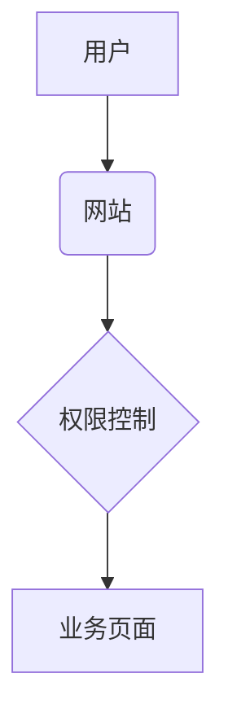

一般我们写后台系统，权限控制是必不可少的。最简单的场景如下：

```mermaid
flowchart TD
    User[用户] --> Website(网站)
    Website --> Permission{权限控制}
    Permission --> App[业务页面]
```

当然这是最简单的场景，实际上我们的系统会更复杂一些，比如：

```mermaid
flowchart TD

```
